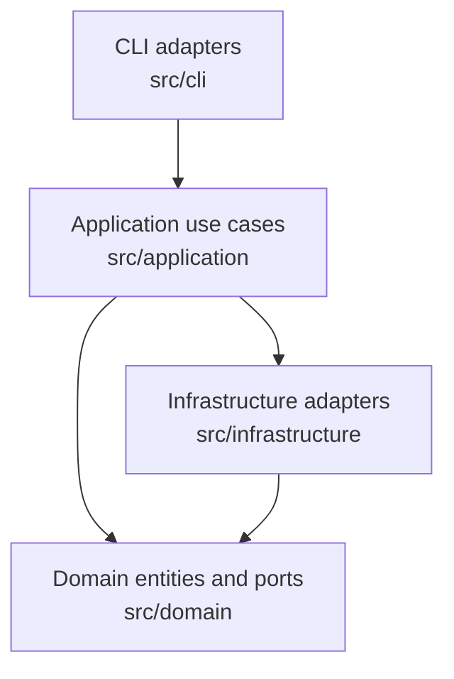

# Architecture Evidence

This file captures deterministic architectural evidence. Use it as a base for refined architecture documentation.

## Layer map

## Boundary evidence

- CLI reads argv, resolves inputs, loads environment variables, and composes dependencies.
- Application owns orchestration and end-to-end control flow.
- Domain owns lifecycle rules, compatibility checks, and contracts.
- Infrastructure implements ports and isolates filesystem, subprocess, SDK, and network details.

## File inventories

### CLI

- `src/cli/AGENTS.md`
- `src/cli/cli-argument-parser.ts`
- `src/cli/default-transcriber-binding-factory.ts`
- `src/cli/input-path-resolver.ts`
- `src/cli/main.ts`
- `src/cli/transcription-cli-application.ts`

### Application

- `src/application/AGENTS.md`
- `src/application/merge-transcripts-use-case.ts`
- `src/application/run-batch-transcription-use-case.ts`
- `src/application/run-transcription-job-use-case.ts`

### Domain

- `src/domain/AGENTS.md`
- `src/domain/entities/AGENTS.md`
- `src/domain/entities/chunk-manifest.ts`
- `src/domain/entities/job-chunk.ts`
- `src/domain/entities/job.ts`
- `src/domain/entities/transcription-result.ts`
- `src/domain/ports/AGENTS.md`
- `src/domain/ports/job-store.ts`
- `src/domain/ports/media-segmenter.ts`
- `src/domain/ports/transcriber-binding.ts`
- `src/domain/ports/transcriber.ts`

### Infrastructure

- `src/infrastructure/AGENTS.md`
- `src/infrastructure/concurrency/AGENTS.md`
- `src/infrastructure/concurrency/task-pool.ts`
- `src/infrastructure/media/AGENTS.md`
- `src/infrastructure/media/ffmpeg-media-segmenter.ts`
- `src/infrastructure/media/ffprobe.ts`
- `src/infrastructure/providers/AGENTS.md`
- `src/infrastructure/providers/fake-transcriber.ts`
- `src/infrastructure/providers/openai-audio-client.ts`
- `src/infrastructure/providers/openai-audio-provider-shared.ts`
- `src/infrastructure/providers/openai-audio-transcriber.ts`
- `src/infrastructure/providers/openai-transcription-config.ts`
- `src/infrastructure/providers/openai-whisper-config.ts`
- `src/infrastructure/providers/openai-whisper-transcriber.ts`
- `src/infrastructure/storage/AGENTS.md`
- `src/infrastructure/storage/chunk-manifest-record.ts`
- `src/infrastructure/storage/file-batch-index-writer.ts`
- `src/infrastructure/storage/file-job-store.ts`
- `src/infrastructure/storage/job-persistence-mapper.ts`
- `src/infrastructure/storage/job-state-record.ts`
