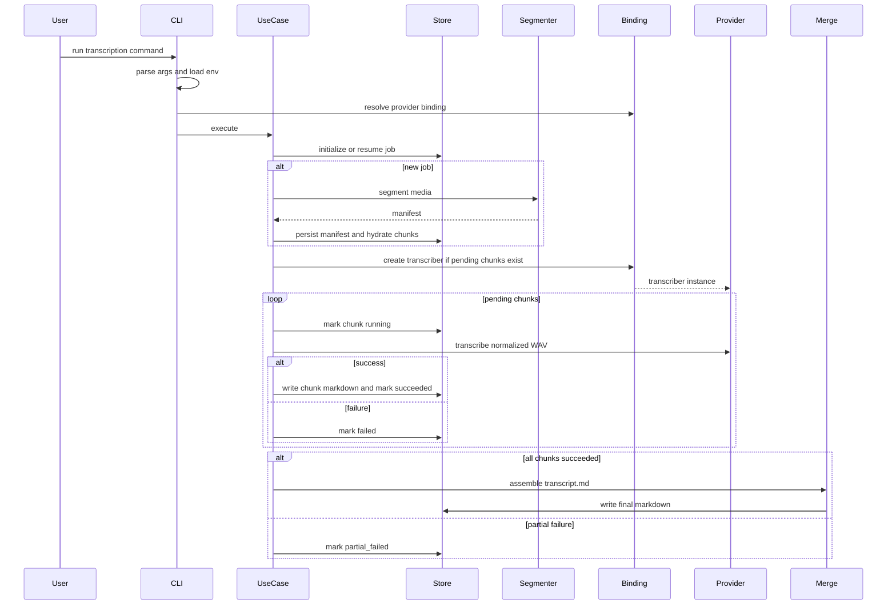

# Transcription Workflow Evidence

This file is deterministic evidence for the end-to-end transcription workflow.

## Observed exit paths

- Full success: final markdown written and exit code `0`
- Partial failure: reusable state persisted and exit code `2`
- Fatal error: job moves to `fatal_error` when possible and exit code `1`
