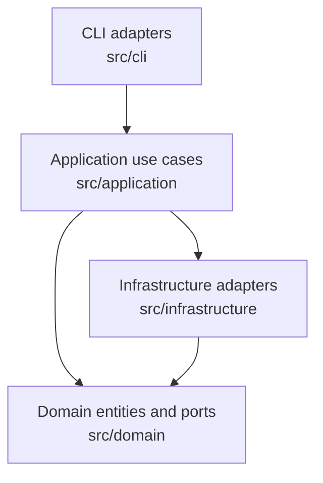

# Architecture Evidence

This file captures deterministic architectural evidence. Use it as a base for refined architecture documentation.

## Layer map

## Boundary evidence

- CLI reads argv, resolves inputs, loads environment variables, and composes dependencies.
- Application owns orchestration and end-to-end control flow.
- Domain owns lifecycle rules, compatibility checks, and contracts.
- Infrastructure implements ports and isolates filesystem, subprocess, SDK, and network details.

## File inventories

### CLI

- `src/cli/main.ts`

### Application

- `src/application/run-transcription-job-use-case.ts`

### Domain

- `src/domain/entities/job.ts`

### Infrastructure

- `src/infrastructure/providers/fake-transcriber.ts`
- `src/infrastructure/storage/file-job-store.ts`
